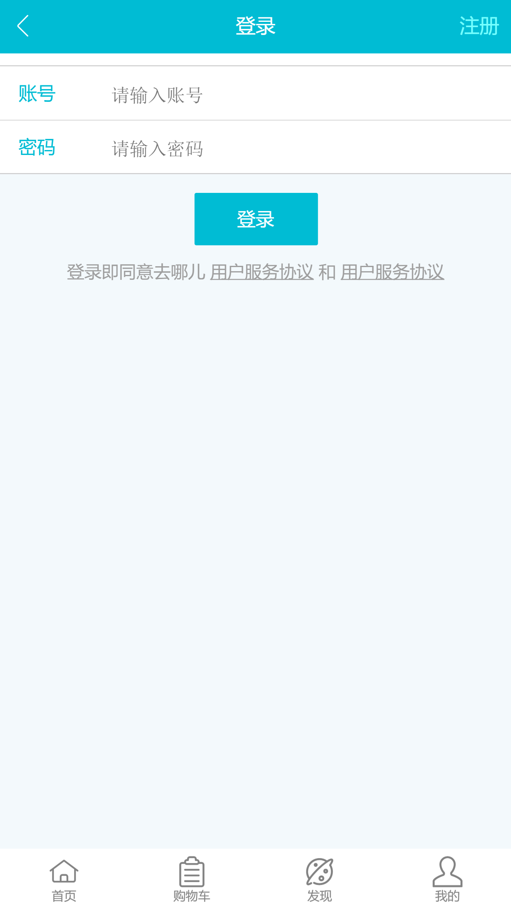
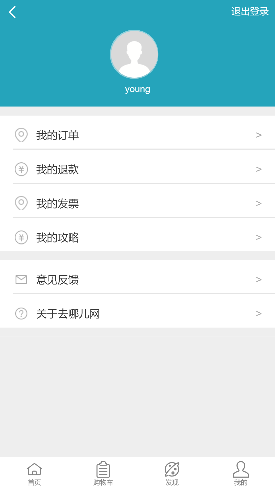
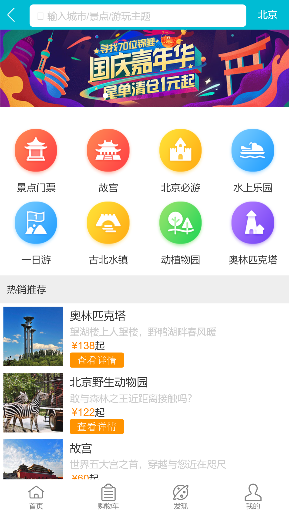
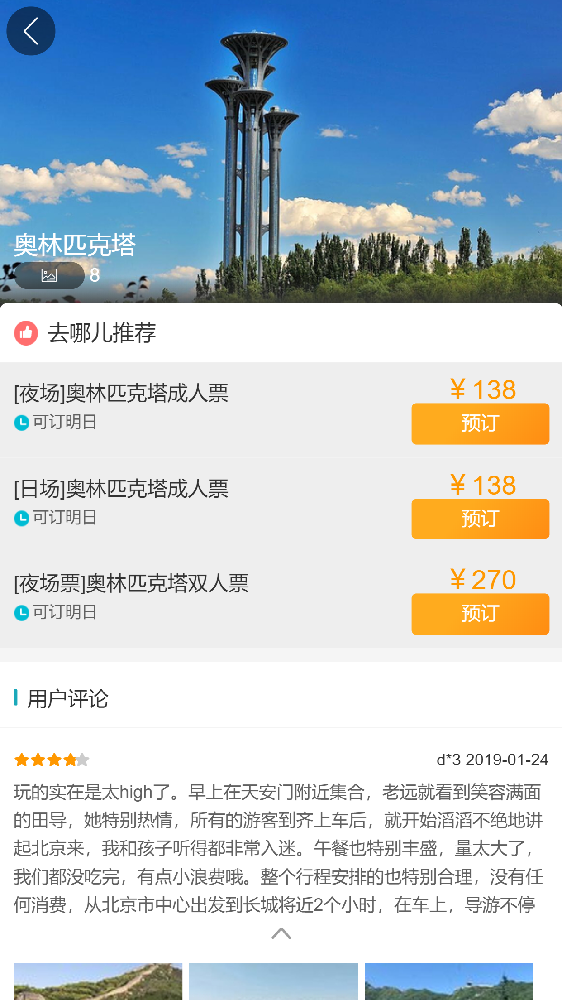
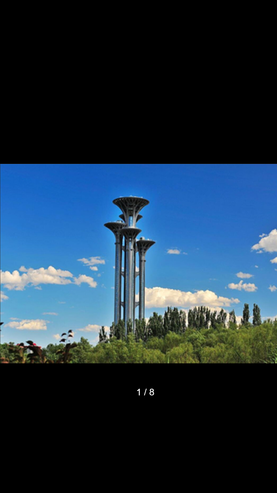
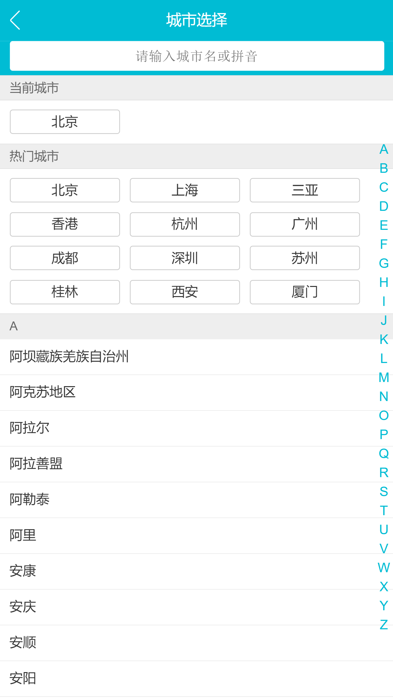
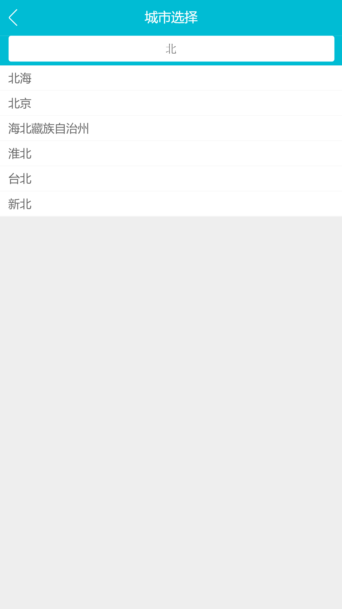
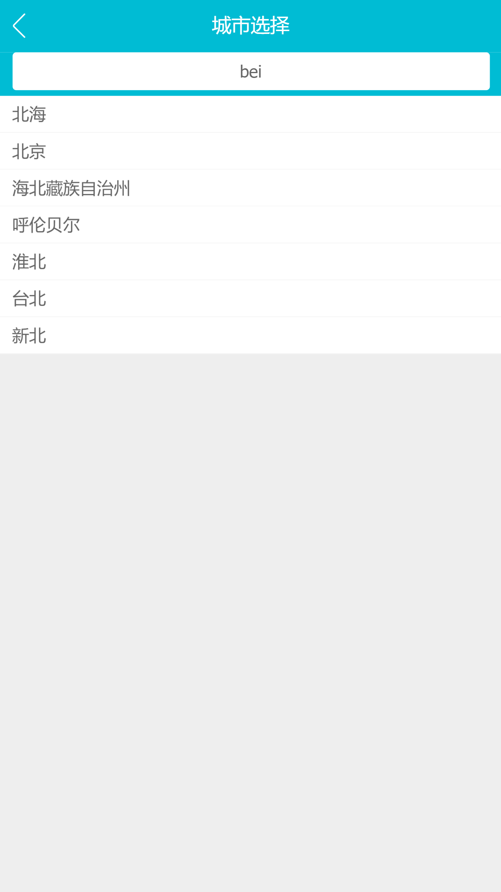

## 前言

此项目是在学习慕课网《前端工程师》系列课程中《仿去哪儿网电商实战》课程时跟着教程敲的，最近复习又把这个项目的实现完整过了一遍，并且基于Koa2搭建了一个服务器，用来进行登录验证。通过对项目的学习，加深自己对开发常见功能及快速构建企业级项目的能力。

## 技术栈

Vue2 + Vuex + Vue-Router + Koa + Stylus

## 项目运行

```

git clone https://github.com/wwwyyying/Qunar.git

//开启服务端
cd qunar-server
npm install
npm run dev

//开启前端界面
cd qunar-fe
npm install
npm run serve
```

## 主要功能

**登录页**

- [x] 登录拦截（用户未登录状态无法看到其他页面）
- [ ] 登录（未进行登录验证，默认都是新用户）

**我的页**

- [x] 退出登录

**首页**

- [x] 图片和景点类别轮播效果
- [x] 景点列表循环展示

**景点详情页**

- [x] 画廊组件（点开景点图片可看到，淡入淡出效果）
- [x] 用户评论组件（静态页面）

**城市选择页**

- [x] 选择城市并同步到首页
- [x] 搜索城市
- [x] 右侧字母表和左侧城市列表的联动效果


## 部分截图

**登录页**



**我的页**



**首页**



**景点详情页**




**城市选择页**





## 项目布局

```
|-- Qunar fe
    |-- .browserslistrc                             // 浏览器兼容配置文件
    |-- .eslintrc.js                                // eslint配置文件
    |-- .gitignore                                  // 上传需要忽略的文件格式
    |-- babel.config.js                             // 工具链
    |-- package-lock.json                           // 实际安装的模块的具体来源和版本号
    |-- package.json                                // 项目开发所需要模块
    |-- README.md                                   // 开发文档
    |-- vue.config.js                               // vue配置文件
    |-- public                                      // 项目入口文件
    |   |-- index.html
    |   |-- mock
    |       |-- city.json
    |       |-- detail.json
    |       |-- index.json
    |-- src// 源码目录
        |-- App.vue                                 // 页面入口文件
        |-- main.js                                 // 程序入口文件，加载各种公共组件
        |-- api
        |   |-- axios.js                            // 封装axios
        |-- assets                                  // 静态资源
        |   |-- img
        |   |   |-- address.png
        |   |   |-- email.png
        |   |   |-- header.png
        |   |   |-- money.png
        |   |   |-- question.png
        |   |-- styles
        |       |-- border.css
        |       |-- iconfont.css
        |       |-- mixins.styl
        |       |-- reset.css
        |       |-- varibles.styl
        |       |-- iconfont
        |           |-- iconfont.eot
        |           |-- iconfont.svg
        |           |-- iconfont.ttf
        |           |-- iconfont.woff
        |           |-- iconfont.woff2
        |-- common                                  // 公共组件
        |   |-- fade
        |   |   |-- FadeAnimation.vue               // 淡入淡出动画组件
        |   |-- gallery
        |       |-- Gallery.vue                     // 画廊组件
        |-- pages
        |   |-- city
        |   |   |-- City.vue                        // 城市选择页
        |   |   |-- components
        |   |       |-- Alphabet.vue                // 字母表组件
        |   |       |-- Header.vue                  // 头部组件
        |   |       |-- List.vue                    // 城市列表组件
        |   |       |-- Search.vue                  // 城市搜索组件
        |   |-- detail
        |   |   |-- Detail.vue                      // 景点详情页
        |   |   |-- components
        |   |       |-- Banner.vue                  // 轮播组件
        |   |       |-- Comment.vue                 // 用户评论组件
        |   |       |-- Header.vue                  // 头部组件
        |   |       |-- List.vue                    // 推荐列表
        |   |-- home
        |   |   |-- Home.vue                        // 首页
        |   |   |-- components
        |   |       |-- Footer.vue                  // 底部组件
        |   |       |-- Header.vue                  // 头部组件
        |   |       |-- Icons.vue                   // 类别组件
        |   |       |-- Recommend.vue               // 猜你喜欢组件
        |   |       |-- Swiper.vue                  // 触摸滑动组件
        |   |       |-- Weekend.vue                 // 周末去哪儿组件
        |   |-- login
        |   |   |-- Login.vue                       // 登录页
        |   |   |-- components
        |   |       |-- Header.vue                  // 头部组件
        |   |       |-- Input.vue                   // 用户输入组件
        |   |-- me
        |       |-- Me.vue                          // 我的页
        |       |-- components
        |           |-- Content.vue                 // 内容展示组件
        |           |-- Header.vue                  // 头部组件
        |-- router
        |   |-- index.js                            // 路由配置
        |-- store
            |-- actions.js                          // 配置actions
            |-- index.js                            // 引用vuex，创建store
            |-- mutations.js                        // 配置mutations
            |-- state.js                            // 配置state
```

```
|-- Qunar-server
    |-- .gitignore                                  // 上传需要忽略的文件格式
    |-- app.js                                      // 入口文件
    |-- package-lock.json
    |-- package.json
    |-- bin
    |   |-- www                                     // node启动文件
    |-- public
    |   |-- jsons                                   // 数据资源
    |       |-- city.json                           // 城市数据
    |       |-- detail.json                         // 景点详情数据
    |       |-- index.json                          // 首页数据
    |       |-- user.json                           // 用户数据
    |-- routes
    |   |-- index.js                                // 路由入口
    |   |-- users.js                                // 自定义user路由
    |-- views                                       // 页面层
        |-- error.ejs
        |-- index.ejs
```